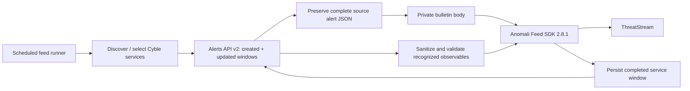

<p align="center">
  <a href="https://cyble.com/"></a>
  &nbsp;&nbsp;&nbsp;&nbsp;&nbsp;&nbsp;
  <a href="https://www.anomali.com/"></a>
</p>

<h1 align="center">Cyble Vision → Anomali ThreatStream</h1>

<p align="center">Continuous alert ingestion through the Anomali Feed SDK.</p>

<p align="center">
  <a href="https://github.com/Prank1004/cyble-anomali-threatstream/actions/workflows/ci.yml"></a>
  <a href="LICENSE"></a>
  
  
  
</p>

<p align="center">
  <a href="docs/deployment.md">Deploy</a> ·
  <a href="docs/api-mapping.md">Field mapping</a> ·
  <a href="docs/operations.md">Operate</a> ·
  <a href="docs/validation.md">Validation</a> ·
  <a href="docs/anomali-handoff.md">Anomali review</a> ·
  <a href="CONTRIBUTING.md">Contribute</a>
</p>

This connector polls **Cyble Vision Alerts API v2** and sends private alert bulletins and validated indicators to **Anomali ThreatStream**. Your feed runner schedules repeated polls for continuous ingestion. Cyble's JSON API is the source; a STIX/TAXII subscription is not required.

> **Version 0.5.0 — integration preview for vendor review.** Local and CI checks cover the implementation; live ThreatStream acceptance remains pending. Only `iocs` and `new_vulnerability` detail schemas have been inspected against live Cyble responses. The SDK pins dependencies with published advisories; see the [Anomali handoff](docs/anomali-handoff.md) for vendor decisions and the [validation record](docs/validation.md) for measured coverage. This is an independent community project, with no Cyble or Anomali endorsement.

## What it does

- Discovers alert-capable services with `CYBLE_SERVICES=all`, or polls an explicit service list.
- Creates one private ThreatStream bulletin per alert, retaining every source field and value in its JSON body by default, including raw text, exposed credentials, and personal data.
- Offers `CYBLE_CONTENT_MODE=redacted` when a deployment requires the previous sanitization policy.
- Attaches recognized IPs, domains, URLs, and hashes as native ThreatStream Indicators; supports service-specific JSON paths.
- Polls creation and update timestamps with replay overlap and persisted service checkpoints.
- Keeps false-positive alert status in the bulletin without creating new indicators for that alert.
- Uses verified TLS, bounded polling, guarded checkpoints, and logs that exclude source payloads and credentials.

## How data moves



Each process invocation performs bounded work and exits. Configure the ThreatStream feed runner to invoke it repeatedly—for example, every five minutes—and prevent overlapping runs. Poll cadence is controlled by that runner; the repository does not install a scheduler automatically.

## Quick start

You need Python 3.10 or 3.11, a Cyble Alerts API v2 token and company UUID, a provisioned ThreatStream feed, and Anomali Feed SDK **2.8.1** obtained through Anomali. The proprietary SDK is not distributed here.

```bash
git clone https://github.com/Prank1004/cyble-anomali-threatstream.git
cd cyble-anomali-threatstream
python3.11 -m venv .venv
.venv/bin/python -m pip install /secure/path/anomali_feedsdk-2.8.1-py3-none-any.whl
.venv/bin/python -m pip install -r requirements.txt
```

Configure the following through the feed runner's secret and environment store. [`.env.example`](.env.example) documents the names; the connector does not automatically load `.env` files.

| Variable | Value |
|---|---|
| `CYBLE_API_TOKEN` | Cyble API Bearer token |
| `CYBLE_COMPANY_UUID` | Company scope for alert queries |
| `CYBLE_SERVICES` | `all`, or a comma-separated list such as `iocs,new_vulnerability` |
| `CYBLE_CONTENT_MODE` | `full` by default; `redacted` is optional |
| `CYBLE_WITH_DATA_MESSAGE` | `true`; required for full-content ingestion |
| `TS_USERNAME`, `TS_API_KEY` | ThreatStream API credentials |
| `TS_API_URL` | Your ThreatStream API base URL |
| `TS_FEED_ID`, `TS_FEED_NAME` | Your provisioned feed identity |

Inspect the version and Cyble catalogue, preview mapping, then configure the scheduled command:

```bash
.venv/bin/python source/cyble_anomali_feed.py --version

# Read-only service discovery; no ThreatStream write.
.venv/bin/python source/cyble_anomali_feed.py --list-services

# Fetch at most one alert per service and validate SDK models locally.
# No ThreatStream ingestion or checkpoint write.
.venv/bin/python source/cyble_anomali_feed.py --dry-run

# Run one ingestion cycle; schedule this command in the feed runner.
.venv/bin/python source/cyble_anomali_feed.py
```

`all` selects catalogue entries with `allowAlerts=true`. It covers accessible services exposed by Alerts API v2; it does not add other Cyble product APIs or retrieve fields the API does not return. Discovery does not prove subscription entitlement or a working payload for every service. A permissions or schema error must be resolved before its checkpoint can progress. Start with the [deployment guide](docs/deployment.md) for feed permissions, rollout, configuration, and content-mode migration.

## Where every Cyble field goes

| Cyble content | ThreatStream destination |
|---|---|
| Alert identity | Stable bulletin identity and `original_source_id` |
| Service, status, severity, timestamps | Bulletin summary and original fields in its JSON body |
| Every field, nested object, array, string, number, boolean, and null | Original keys, types, and values in the private bulletin JSON body in `full` mode |
| Recognized IP, domain, URL, and hash values | Native Indicators associated with the bulletin, after validation |
| Service-specific IOC paths | Configurable extraction via the [field map](config/field-map.example.json) |
| Exposed credentials, tokens, emails, usernames, personal data, and internal IPs returned by Cyble | Retained in the private bulletin body in `full` mode; not promoted to malicious Indicators |
| Raw text and JSON-encoded strings | Retained as the original strings in `full` mode |
| Attachment metadata and URLs returned in the alert | Retained in the body; binary files and linked content are not downloaded |

**Preserving a field in bulletin JSON does not create a native ThreatStream field.** Arbitrary Cyble fields remain available as context; native observable mapping is limited to supported types. Cyble risk/confidence labels are retained without inventing an equivalent Anomali score. Native Indicators and summary fields use a sanitized derivative of the alert in both content modes.

Full mode intentionally stores source exposure data in the private bulletin body. Connector authentication credentials remain in the runtime secret store and are never added to report bodies. Logs, public issues, and fixtures must contain no real source payloads or secrets. Optional `redacted` mode retains the previous field redaction and raw-text omission policy.

False-positive records remain visible for context and status tracking. They produce no new Indicators. Previously associated or shared ThreatStream indicators are not automatically deleted or revoked when an alert changes status.

Accepted report IDs are checked before progress is saved. Native IOC CSV ingestion remains asynchronous, and the hosted SDK cache can suppress refreshed attributes; verify final report and indicator state in your tenant.

Large or excessively nested records stop their poll window without silent truncation. Changing content modes replays the configured lookback so recent bulletins can be updated; it does not automatically restore all older history. Full details, supported response envelopes, custom paths, and data handling are in [field mapping](docs/api-mapping.md).

## Repository guide

| Path | Purpose |
|---|---|
| [`source/`](source/) | Cyble API client and Feed SDK ingestion entry point |
| [`config/field-map.example.json`](config/field-map.example.json) | Common paths and per-service IOC/context rules |
| [`.env.example`](.env.example) | Configuration names and defaults |
| [`docs/deployment.md`](docs/deployment.md) | Installation, scheduling, and upgrade instructions |
| [`docs/operations.md`](docs/operations.md) | Checkpoints, recovery, and troubleshooting |
| [`docs/validation.md`](docs/validation.md) | Validation evidence and remaining integration checks |
| [`SECURITY.md`](SECURITY.md) | Private vulnerability reporting and data handling |

Use the [Cyble API portal](https://cyble.ai/utilities/access-apis?tab=alerts-api-v2) for vendor API documentation. Report reproducible connector issues with synthetic data through the [issue templates](https://github.com/Prank1004/cyble-anomali-threatstream/issues/new/choose).

## License and trademarks

Connector code is licensed under [MIT](LICENSE). The Anomali SDK retains its separate proprietary license. Vendor logos are unmodified remote assets from the official websites, used to identify the connected products; they are not covered by this repository's MIT license. See [NOTICE](NOTICE.md) and [logo sources](assets/README.md).
