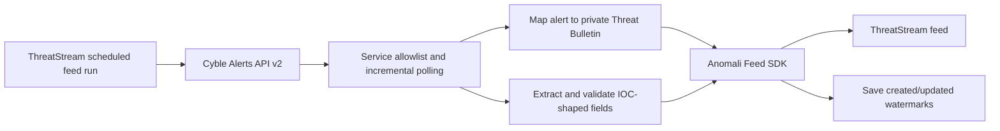

# Cyble Vision Alerts → Anomali ThreatStream Feed

A scheduled Python connector that reads Cyble Vision Alerts API v2 and ingests alert bulletins plus validated observables into Anomali ThreatStream through the Anomali Feed SDK 2.8.1. It uses Cyble's JSON API directly; STIX and TAXII are not required.

> **Status: integration preview, 0.3.0.** The live Cyble MCP service catalogue exposed 52 alert service names for the connected tenant. Response schemas vary by service. The connector preserves the complete structured record for every configured service in the ThreatStream report body, while also mapping recognized observables into native Indicators. Only `iocs` and `new_vulnerability` detailed payloads have been inspected live. No ThreatStream tenant write has been performed from this development workspace.

## Data flow



The connector makes one bounded poll per invocation. Configure the ThreatStream feed runner to invoke it on the interval you want (for example, every five minutes) for continuous ingestion. It stores created-at and updated-at watermarks in the ThreatStream feed configuration and uses a configurable overlap to recover boundary records.

## Mapping

Each Cyble alert becomes a private ThreatStream `tipreport` bulletin. The full structured alert record, including service-specific nested objects and arrays, is preserved in its report body after sensitive-value sanitization. Recognized indicators are also associated as native ThreatStream Indicators. Cyble's arbitrary service-specific fields do not have one-to-one native ThreatStream fields, so their original field names and sanitized values remain together in the embedded JSON.

| Cyble Alerts API v2 field | ThreatStream mapping |
|---|---|
| `id` (or `uuid` / `alertId`) | Stable bulletin name and `original_source_id` |
| `service`, `status`, `severity`, `user_severity` | Bulletin metadata and tags; alert severity is mapped to observable severity when supported |
| `created_at`, `updated_at` | Bulletin source timestamps |
| `ioc`, `data.ioc` | IOC candidates, validated by the Anomali SDK |
| `data.ioc_type` | Type hint for Cyble IOC values; the SDK validates the final Anomali iType |
| `data.hosting_ip` | Additional IOC candidate |
| `data.first_seen`, `data.last_seen`, `first_seen_on`, `last_seen_on` | Observable source timestamps and bulletin context |
| `data.confident_rating`, `data.risk_rating`, `data.behaviour_tags`, `data.ioc_attack_name`, `data.reference_link` | Preserved in the full JSON report body; risk/confidence labels are not converted into an Anomali confidence score |
| `cve` and every other structured Cyble field | Preserved under the original field name in the report's sanitized JSON body |
| Recognized IOC values anywhere in the record | Validated and attached as native ThreatStream Indicators |

Cyble's live `iocs` payload can include service data encoded as JSON. The connector parses structured JSON strings and preserves the resulting fields in the report body. Non-JSON free-text content is omitted; sensitive values are replaced with markers while field names remain. The report body is rejected rather than silently truncated if it exceeds `CYBLE_MAX_REPORT_BYTES`.

`config/field-map.example.json` supports dotted paths, `[*]` array expansion, and a per-service override. Example:

```json
{
  "default": {
    "ioc_rules": [
      {"value_path": "data.indicators[*].value", "type_path": "data.indicators[*].type"}
    ]
  },
  "services": {
    "my_service": {
      "ioc_rules": [
        {"value_path": "data.confirmed_non_sensitive_field", "type": "url"}
      ],
      "context_paths": [
        {"path": "data.confirmed_non_sensitive_label", "label": "Service context"}
      ]
    }
  }
}
```

The `my_service` names above are examples, not Cyble fields. Use actual paths from the corresponding service response when IOC values use nonstandard field names. `context_paths` adds selected safe fields to the report summary; every structured field is already preserved in the embedded alert JSON.

### Data handling

- Visibility is fixed to private and TLP defaults to amber.
- `FALSE_POSITIVE` alerts are excluded by the Cyble query.
- Email addresses, usernames, passwords, tokens, cookies, card/SSN/phone values and other recognized sensitive fields are redacted from report JSON; their Cyble field names remain visible. Sensitive values and non-public IP addresses are excluded from observable extraction.
- Structured `dataMessage` content is fetched in memory by default, sanitized, and included in each report body; set `CYBLE_WITH_DATA_MESSAGE=false` for metadata-only polling. Non-JSON free-text content fields are represented by omission markers. Descriptions are retained after common email, SSN, payment-card, and credential-assignment redaction.
- A sanitized alert larger than `CYBLE_MAX_REPORT_BYTES` or deeper than the supported nesting limit fails the poll. The connector does not truncate it or advance its checkpoint, so the condition can be reviewed and corrected.
- Cyble risk ratings and confidence labels are preserved as text context. They are not treated as Anomali source confidence because those scales are not documented as equivalent.
- The connector is read-only against Cyble. It does not update Cyble alert status or add comments.

## Requirements

- Python 3.10 or 3.11.
- An Anomali ThreatStream feed configured with the Feed SDK 2.8.1 runtime.
- Cyble Alerts API v2 access, the tenant company UUID, and network access to `bifrost.cyble.ai`.
- Outbound HTTPS to the configured ThreatStream API endpoint.

The supplied Anomali wheel is proprietary and intentionally not included. Obtain it through Anomali's approved channel, keep it outside this repository, and install it in the feed runtime. Then install the connector dependency:

```bash
python3 -m pip install /secure/path/anomali_feedsdk-2.8.1-py3-none-any.whl
python3 -m pip install -r requirements.txt
```

Do not add the wheel, SDK source, Cyble API PDF, or tenant data to GitHub.

## Configuration

Supply these values through the Anomali feed runner's secret/environment configuration. Do not commit a populated `.env` file.

| Variable | Required | Purpose |
|---|---:|---|
| `CYBLE_API_TOKEN` | Yes | Cyble Bearer token |
| `CYBLE_COMPANY_UUID` | Yes | Tenant scope required by the live Alerts API endpoint |
| `CYBLE_SERVICES` | Yes | Explicit comma-separated service allowlist, such as `iocs,new_vulnerability` |
| `TS_USERNAME` | Yes | ThreatStream API username |
| `TS_API_KEY` | Yes | ThreatStream API key |
| `TS_API_URL` | Yes | ThreatStream API base URL |
| `TS_FEED_ID` | Yes | Feed ID provisioned in ThreatStream |
| `TS_FEED_NAME` | Yes | Feed name provisioned in ThreatStream |
| `CYBLE_INITIAL_LOOKBACK_HOURS` | No | First-run window; default 24, maximum 8,760 |
| `CYBLE_PAGE_SIZE` | No | Default 200; maximum 200 with detailed payloads or 2,000 without |
| `CYBLE_MAX_PAGES_PER_SERVICE` | No | Per-service/per-date-field page guard; default 100 |
| `CYBLE_OVERLAP_SECONDS` | No | Replay boundary window; default 300 seconds |
| `CYBLE_SYNC_UPDATED_ALERTS` | No | Poll `updated_at` as well as `created_at`; default true |
| `CYBLE_WITH_DATA_MESSAGE` | No | Fetch typed service data in memory; default true |
| `CYBLE_THREAT_TYPE` | No | Anomali threat type; default `malware`, review against your feed semantics |
| `CYBLE_TLP` | No | `amber`, `green`, `red`, or `white`; default `amber` |
| `CYBLE_FIELD_MAP_PATH` | No | Path to a customized JSON mapping file |
| `CYBLE_MAX_RUN_MINUTES` | No | Stop before the SDK runtime limit; default 20 |
| `CYBLE_MAX_REPORT_BYTES` | No | Maximum sanitized alert JSON size in a report body; default 4 MiB. Oversized records fail the poll without checkpoint advancement. |

The Cyble `/services` endpoint is available for discovery. To list the services accessible to the configured token:

```bash
python3 source/cyble_anomali_feed.py --list-services
```

`CYBLE_SERVICES` may include any service entitled to the API token. Choose the allowlist deliberately, especially for credential-bearing services. The connector preserves every structured field for those services while redacting recognized credential and personal-data values; raw unstructured content is omitted.

## Scheduling and operation

Configure the Anomali feed's engine/schedule to run this command at the desired interval:

```bash
python3 source/cyble_anomali_feed.py
```

A run fails without advancing its watermark if an API request fails, the response schema is unrecognized, or a configured page/time guard is reached. The next scheduled invocation retries from the previous checkpoint with overlap; Anomali's feed model cache and stable alert IDs handle replay.

The connector uses verified TLS for Cyble and ThreatStream, bounded retries for transient Cyble errors, and the SDK's configured proxy settings. Logs contain counts and service names only, not response bodies, IOC values, or credentials.

## Cyble documentation

- [Cyble Vision API access](https://cyble.ai/utilities/access-apis?tab=alerts-api-v2) — Alerts API v2 access and documentation.

This is an independent community connector. It is not endorsed or supported by Cyble or Anomali.
